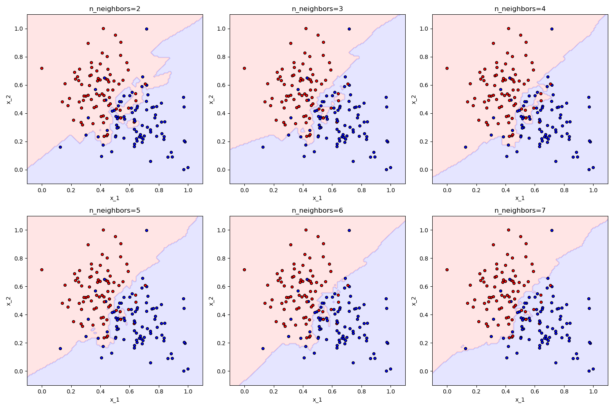

# K-Nearest Neighbors (KNN) Implementation

## Overview

This project demonstrates the implementation of the **K-Nearest Neighbors (KNN)** algorithm from scratch in Python. The
model is trained and evaluated using a synthetic classification dataset with two classes. The performance of the model
is assessed by measuring accuracy across different numbers of neighbors.

## Key Features

- **Custom Implementation**: The KNN algorithm is implemented from scratch, without relying on high-level libraries.
- **Evaluation Metrics**: The model's performance is evaluated using accuracy.
- **Visualization**: Decision boundary plots are generated to visualize the model's classification decision for
  different values of `n_neighbors`.

## Table of Contents

1. [Requirements](#requirements)
2. [Installation](#installation)
3. [Usage](#usage)
4. [Methodology](#methodology)
5. [Results](#results)
6. [Conclusion](#conclusion)

## Requirements

- Python 3.x
- NumPy
- Matplotlib
- Scikit-learn (for data generation)

## Installation

Clone the repository:

```bash
git clone https://github.com/pramodyasahan/AI-Algorithms-FromScratch.git
cd algorithms/supervised_lerning/k_nearest_neighbours
```

Install the required Python packages:

```bash
pip install numpy matplotlib scikit-learn
```

## Usage

To run the KNN implementation and visualize the results, execute the following script:

```bash
python train.py
or
python3 train.py
```

The script will perform the following:

- Train the KNN model on a synthetic dataset with varying `n_neighbors`.
- Evaluate the model and print accuracy for each `n_neighbors` value.
- Generate and display decision boundary plots for each `n_neighbors`.

## Methodology

#### Data Preparation

- A synthetic classification dataset is generated using `sklearn.datasets.make_blobs`, with two classes.
- The dataset is split into training and test sets.
- The features are normalized using min-max scaling.

#### Model Training

- The KNN algorithm is implemented from scratch, and the model is trained for different values of `n_neighbors`.

#### Evaluation

- Accuracy is calculated for each `n_neighbors` value to assess the performance of the model.

#### Visualization

- Decision boundary plots are generated to visualize the model's classification decision boundaries for different
  `n_neighbors` values.

## Results

#### Performance Metrics

- **Accuracy with n_neighbors=2:** 0.93
- **Accuracy with n_neighbors=3:** 0.93
- **Accuracy with n_neighbors=4:** 0.90
- **Accuracy with n_neighbors=5:** 0.90
- **Accuracy with n_neighbors=6:** 0.93
- **Accuracy with n_neighbors=7:** 0.90

### Visualization

The plots below show the decision boundaries for different values of `n_neighbors`. These visualizations illustrate how
the decision boundary changes with the number of neighbors:


## Conclusion

- The KNN model performs consistently well with an accuracy of 0.90 to 0.93 across different `n_neighbors` values.
- The decision boundary plots provide insights into how the model's decision boundary evolves with the number of
  neighbors.
- This project demonstrates the ability to implement and evaluate KNN from scratch, providing a foundation for
  understanding and using this algorithm in classification tasks.

