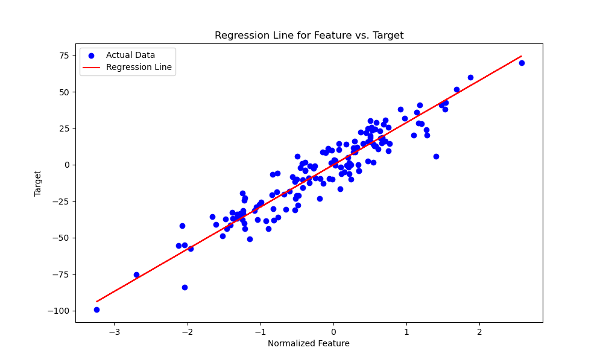

# Linear Regression Implementation from Scratch

## Overview

This project demonstrates the implementation of a **Linear Regression** model from scratch in Python. The model is
trained and evaluated using a synthetic regression dataset generated with noise. The performance of the model is
assessed using Mean Squared Error (MSE) and R² Score.

## Key Features

- **Custom Implementation**: The Linear Regression algorithm is implemented from scratch without relying on high-level
  libraries.
- **Evaluation Metrics**: The model's performance is evaluated using MSE and R² Score.
- **Visualization**: A regression line plot is generated to visualize the model's fit on the test data.

## Table of Contents

1. [Requirements](#requirements)
2. [Installation](#installation)
3. [Usage](#usage)
4. [Methodology](#methodology)
5. [Results](#results)
6. [Conclusion](#conclusion)

## Requirements

- Python 3.x
- NumPy
- Scikit-learn
- Matplotlib

## Installation

Clone the repository:

```bash
git clone https://github.com/pramodyasahan/AI-Algorithms-FromScratch.git
cd algorithms/supervised_lerning/linear_regression
```

Install the required Python packages

```bash
pip install numpy scikit-learn matplotlib
```

## Usage

To run the Linear Regression implementation and visualize the results, execute the following script:

```bash
python train.py
or
python3 train.py
```

The script will perform the following

- Train the Linear Regression model on a synthetic dataset.
- Evaluate the model using Mean Squared Error and R² Score.
- Visualize the regression line on the test data.

## Methodology

#### Data Preparation

- A synthetic regression dataset is generated using sklearn.datasets.make_regression, with added noise to simulate
  real-world scenarios.
- The dataset is split into training and test sets.

#### Model Training

- The LinearRegression class is implemented from scratch using gradient descent to optimize the weights and biases.

#### Evaluation

- Mean Squared Error (MSE) and R² Score are calculated to assess the performance of the model.

#### Visualization

- A regression line plot is generated to visualize the model's predictions against the actual test data.

## Results

#### Performance Metrics

- **Mean Squared Error (MSE):** 88.64

- **R² Score:** 0.89

### Visualization

The plot below shows the regression line fit to the test data


## Conclusion

- The Linear Regression model demonstrates effective performance with an R² Score of 0.89, indicating a good fit on the
  test data.
- The MSE of 88.64 shows the average squared difference between the predicted and actual values.
- This project showcases the ability to implement and evaluate machine learning algorithms from scratch.