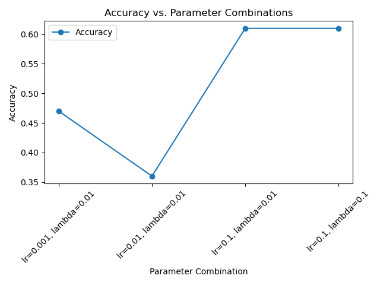
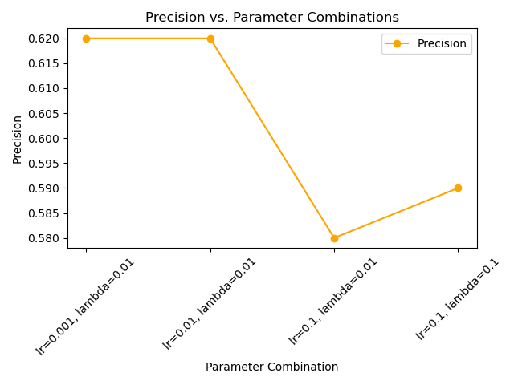
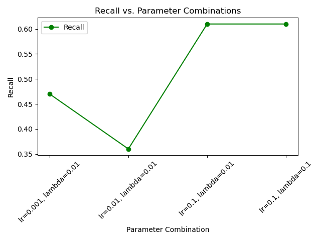
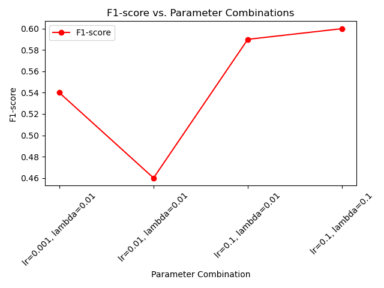

# Support Vector Machine (SVM) Performance Analysis

## Introduction

This document presents the performance analysis of a Support Vector Machine (SVM) model on the Breast Cancer dataset.
The model was trained and evaluated with different values of the learning rate and regularization parameter (lambda) to
observe their impact on the model's performance metrics, including Accuracy, Precision, Recall, and F1-score.

## Methodology

- **Dataset:** The Breast Cancer dataset from scikit-learn.
- **Parameters Tested:**
    - Learning rates: `0.1`, `0.01`, `0.001`
    - Regularization parameter (lambda): `0.01`, `0.1`

## Results

### Performance Metrics

Below are the performance metrics for different combinations of learning rate and lambda:

| Learning Rate | Lambda | Accuracy | Precision | Recall | F1-score |
|---------------|--------|----------|-----------|--------|----------|
| 0.001         | 0.01   | 0.47     | 0.62      | 0.47   | 0.54     |
| 0.01          | 0.01   | 0.36     | 0.62      | 0.36   | 0.46     |
| 0.1           | 0.01   | 0.61     | 0.58      | 0.61   | 0.59     |
| 0.1           | 0.1    | 0.61     | 0.59      | 0.61   | 0.60     |

### Visualizations

To better understand the impact of different parameters, the following plots are provided:

#### 1. Accuracy vs. Parameters

This plot shows the variation of accuracy with different combinations of learning rate and lambda.

#### 2. Precision vs. Parameters

This plot illustrates the changes in precision as we vary the learning rate and lambda.

#### 3. Recall vs. Parameters

This plot demonstrates the effect of parameter changes on recall.

#### 4. F1-score vs. Parameters

This plot highlights how the F1-score is impacted by different parameter settings.

## Conclusion

Based on the results, we observe that:

- A higher learning rate (`0.1`) tends to stabilize the model's performance.
- Lower learning rates (`0.01`, `0.001`) result in decreased accuracy but may provide higher precision in some cases.
- The choice of lambda affects the balance between precision and recall, impacting the overall F1-score.

Further tuning and experimentation with more combinations of hyperparameters might yield improved performance.

## References

- [Breast Cancer Dataset - scikit-learn Documentation](https://scikit-learn.org/stable/datasets/index.html#breast-cancer-dataset)
