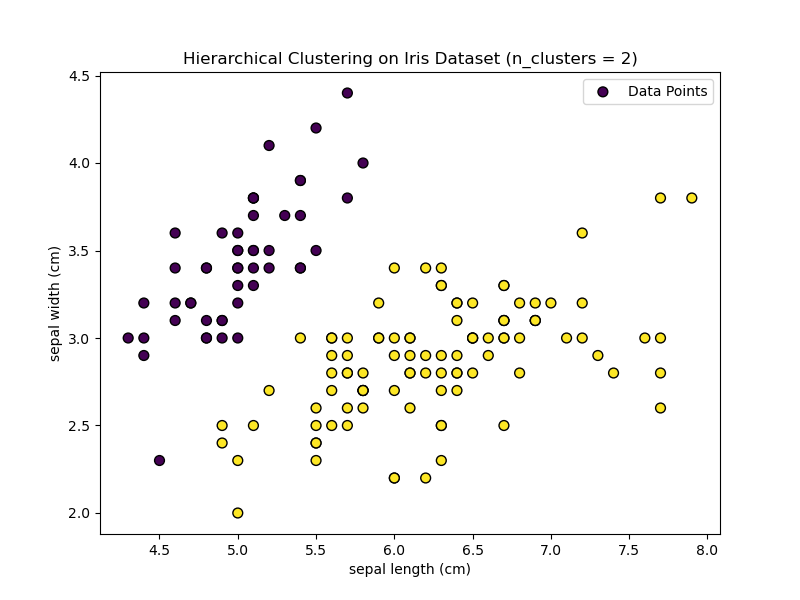
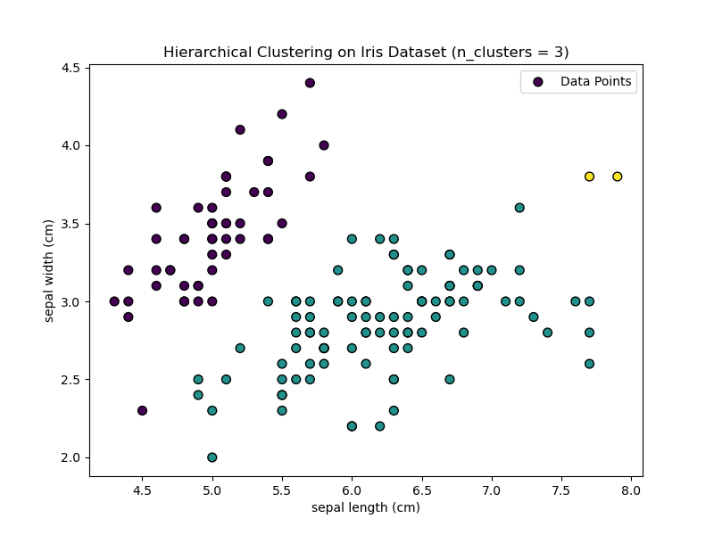
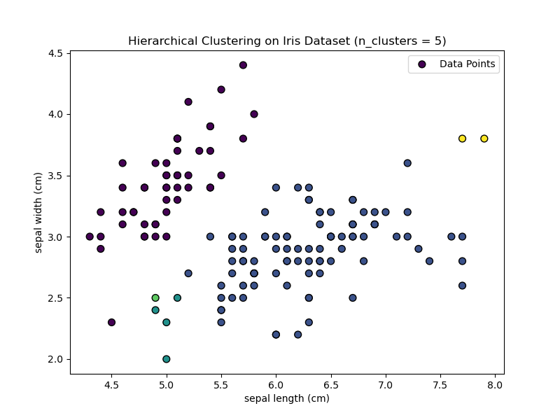
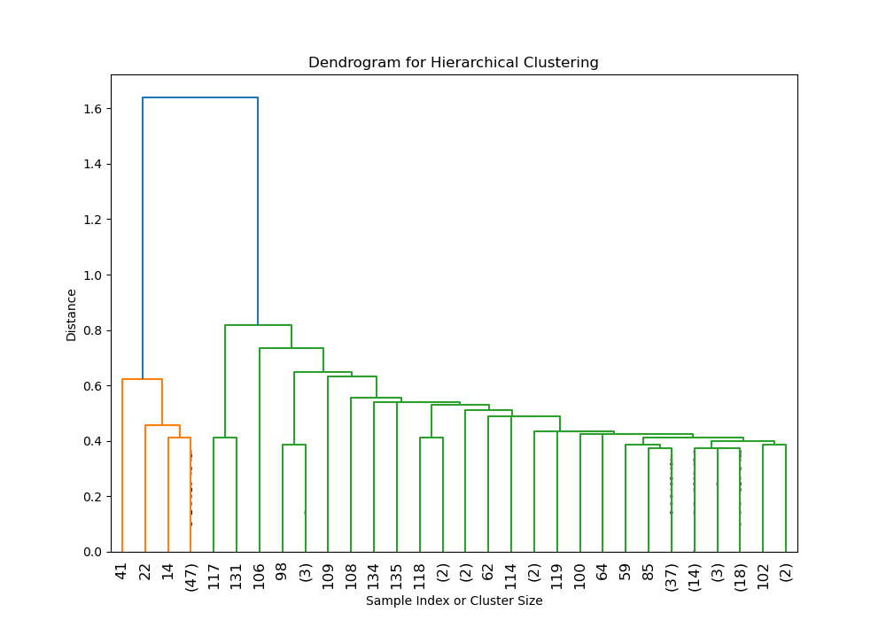

# Hierarchical Clustering Implementation from Scratch

## Overview

This project demonstrates the implementation of a **Hierarchical Clustering** algorithm from scratch in Python. The
algorithm is evaluated using the **Iris dataset**, a standard dataset for clustering tasks, which contains measurements
of different iris flower species.

The project uses the **single linkage** method for clustering and includes both quantitative evaluation using the *
*Silhouette Score** and qualitative evaluation through visualizations (scatter plots and dendrogram).

## Key Features

- **Custom Implementation**: The hierarchical clustering algorithm is implemented from scratch without relying on
  libraries like `scikit-learn`.
- **Evaluation Metrics**: The performance of the algorithm is evaluated using the **Silhouette Score** for different
  numbers of clusters.
- **Visualization**: Scatter plots and dendrograms are generated to visualize the clustering process and results.

## Table of Contents

1. [Requirements](#requirements)
2. [Installation](#installation)
3. [Usage](#usage)
4. [Methodology](#methodology)
5. [Results](#results)
6. [Conclusion](#conclusion)

## Requirements

- Python 3.x
- Matplotlib
- Scikit-learn
- Scipy

## Installation

Clone the repository:

```bash
git clone https://github.com/pramodyasahan/AI-Algorithms-FromScratch.git
cd algorithms/unsupervised_lerning/Hierarchical_Clustering
```

## Installation

Install the required Python packages

```bash
pip install matplotlib scikit-learn scipy
```

## Usage

To run the hierarchical clustering implementation and visualize the results, execute the following script:

```bash
python train.py
or
python3 train.py
```

The script will perform the following:

- Train the Hierarchical Clustering model on the Iris dataset.
- Evaluate the clustering using the Silhouette Score for different values of n_clusters.
- Visualize the clustering results for each value of n_clusters and plot the dendrogram.
- Feel free to edit the range of n_clusters in the script to explore how different cluster numbers affect the clustering
  performance and visualizations

## Methodology

1. Data Preparation

    - The Iris dataset from scikit-learn is used, containing 150 samples from three species of iris flowers (Setosa,
      Versicolor, Virginica) with four features (sepal length, sepal width, petal length, petal width).
2. Model Training

    - The HierarchicalClustering class is implemented from scratch to perform clustering with the single linkage method.
    - The model is trained for different values of n_clusters (ranging from 2 to 5).
3. Evaluation:

    - Silhouette Score: The average silhouette score is calculated for each value of n_clusters. The silhouette score
      measures how similar a point is to its own cluster compared to other clusters. A higher silhouette score indicates
      better-defined clusters.
4. Visualization:

    - Scatter Plots: Generated to visualize the clustering results for each n_clusters.
    - Dendrogram: Generated to illustrate the hierarchical clustering process and show how clusters are merged at each
      step.

## Results

### Silhouette Scores

- The following silhouette scores were obtained for different values of n_clusters:

| Number of Clusters (`n_clusters`) | Silhouette Score |
|-----------------------------------|------------------|
| 2                                 | 0.69             |
| 3                                 | 0.51             |
| 4                                 | 0.28             |
| 5                                 | 0.28             |

The best performance is achieved with **n_clusters = 2**, yielding the highest silhouette score of **0.69**.

### Visualizations

##### Clustering Results

- n_clusters = 2:
  

- n_clusters = 3:
  

- n_clusters = 4:
  

- n_clusters = 5:
  

Dendrogram

- The dendrogram illustrates the hierarchical merging process of the clusters. The height of each merge corresponds to
  the distance between the clusters.
  

## Conclusion

- The hierarchical clustering algorithm performs best with n_clusters = 2, as indicated by the highest silhouette score.
- The scatter plots and dendrogram provide a clear visualization of how the data points are grouped into clusters at
  each step of the hierarchical process.
- This project demonstrates a strong understanding of unsupervised learning concepts and the ability to implement
  clustering algorithms from scratch.