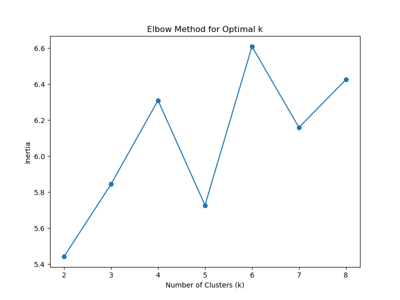
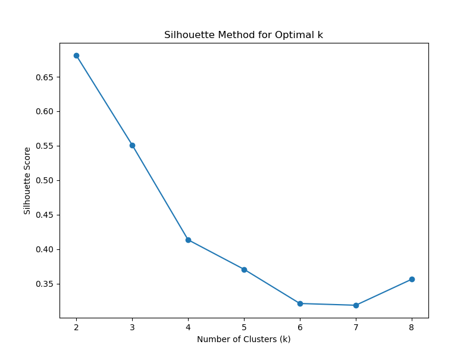
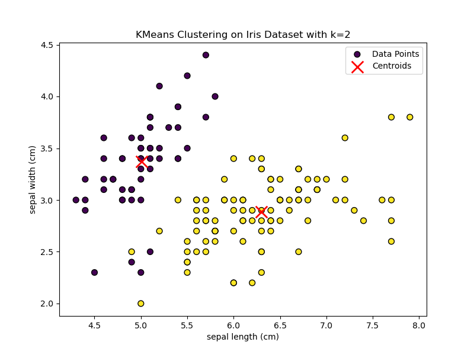
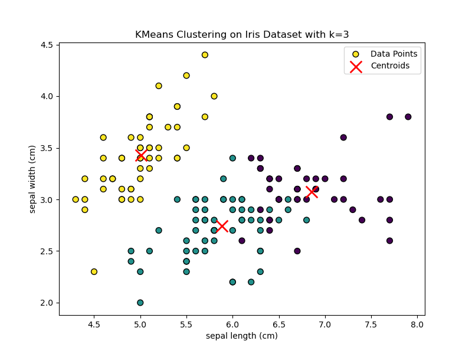
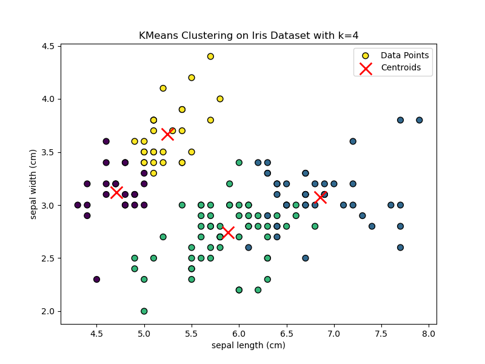
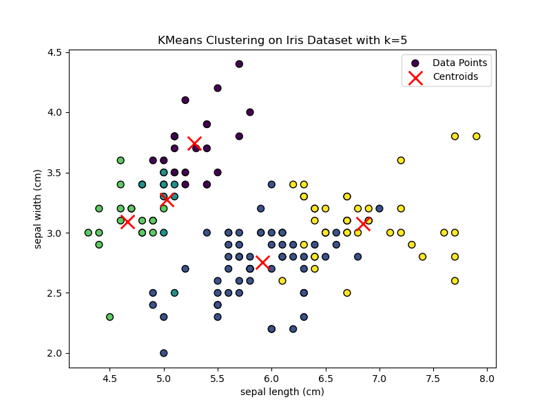
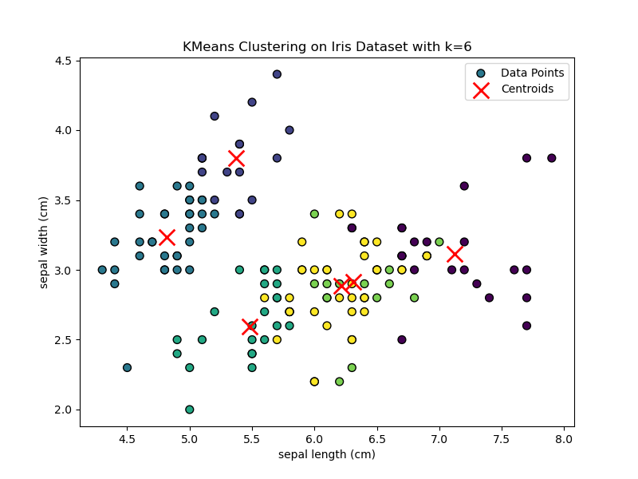

# K-Means Clustering Implementation from Scratch

## Overview

This repository contains an implementation of the **K-Means Clustering** algorithm from scratch in Python. The K-Means
algorithm is a popular unsupervised machine learning technique used to partition a dataset into distinct clusters based
on feature similarity.

The implementation is tested and evaluated using the well-known **Iris dataset**, which contains measurements of
different iris flower species. We use several techniques to determine the optimal number of clusters and provide
visualizations to illustrate the clustering results.

## Key Features

- **Custom Implementation**: K-Means Clustering algorithm built from scratch without using libraries like
  `scikit-learn`.
- **Evaluation Metrics**: Includes the Elbow Method and Silhouette Score to determine the optimal number of clusters.
- **Visualization**: Provides scatter plots to visualize the clustering results for different values of `n_clusters`.
- **Easy to Understand**: The code is well-documented, making it easy to understand the steps involved in the K-Means
  algorithm.

## Table of Contents

1. [Requirements](#requirements)
2. [Installation](#installation)
3. [Results](#results)
4. [Conclusion](#conclusion)

## Requirements

- Python 3.x
- NumPy
- Matplotlib
- Scikit-learn

## Installation

Clone the repository:

```bash
git clone https://github.com/pramodyasahan/AI-Algorithms-FromScratch.git
cd algorithms/unsupervised_lerning/kmeans
```

Install the required Python packages

```bash
pip install numpy matplotlib scikit-learn
```

The script will perform the following:

1. Train the K-Means clustering model on the Iris dataset.
2. Evaluate the clustering using Inertia and Silhouette Scores.
3. Visualize the clustering results for different values of n_clusters.

## Results

1. Elbow Method

    - The plot shows the inertia for different values of n_clusters. The "elbow" point suggests the optimal number of
      clusters, which balances model complexity and clustering quality.
      

2. Silhouette Score

    - The silhouette score plot shows how the clustering quality varies with different values of n_clusters. The peak
      score indicates the optimal number of clusters with well-separated and compact clusters.
      

### Clustering Visualizations

Below are the visualizations of the clustering results for different values of n_clusters:

k = 2:


k = 3:


k = 4:


k = 5:


k = 6:


These visualizations help us understand how the data points are grouped and how the centroids are positioned for
different cluster counts.

## Conclusion

- The Elbow Method and Silhouette Score provide complementary insights to determine the optimal number of clusters for
  the Iris dataset.
- The visualizations show that the K-Means clustering implementation works effectively to group similar data points
  together.
- This project demonstrates a strong understanding of unsupervised learning concepts and the ability to implement
  machine learning algorithms from scratch.

